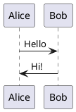

# Exercise 1-1

Exercise from the book Think Like a Programmer.

## Exercise

Try a medium-difficulty Sudoku puzzle.

- Experiment with different strategies
- Take notes of the results
- Write a general plan for solving a Sudoku

## Solution

The following medium-difficulty Sudoku was given by [Sodoku.com](https://sudoku.com/medium/):

